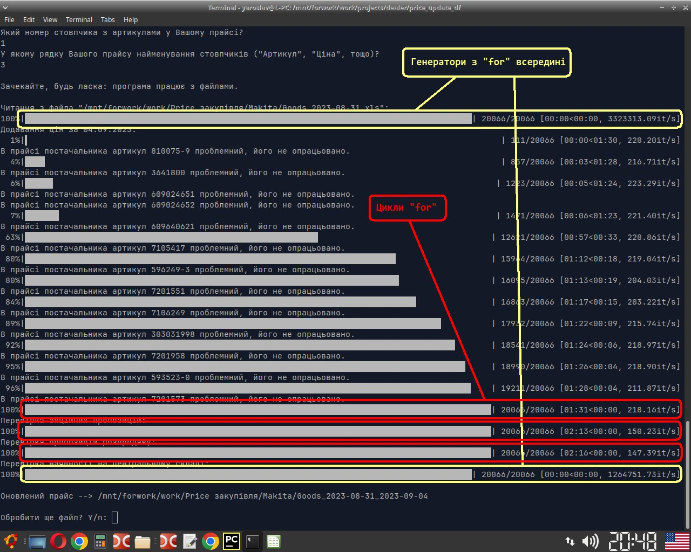
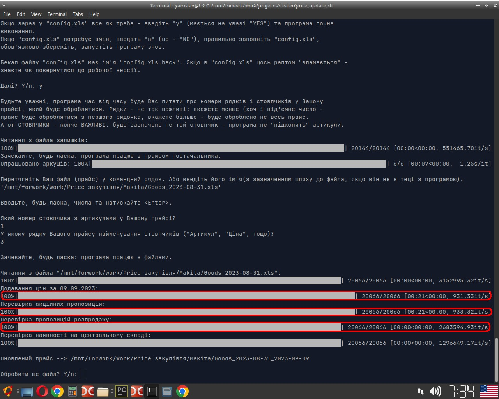

_The program receives 3+ files as input_:
1. goods in the supplier's warehouses (20k+ rows);
2. the current supplier's price list (45k+rows);
3. custom price list(s).

_The program does_:
1. indicates which product from the user price list is in the supplier's main warehouse;
2. updates prices, marks goods as "Sale", "Promo" etc., saves a copy of updated user's price list.

File `"first_version.py"` - first working version of the program.
In `"price_update_df.py"`: editing two functions and using generators instead of external loops increased program speed by 8.5 times.

Program with 2 generators ahd 3 loops:

Only generators:
