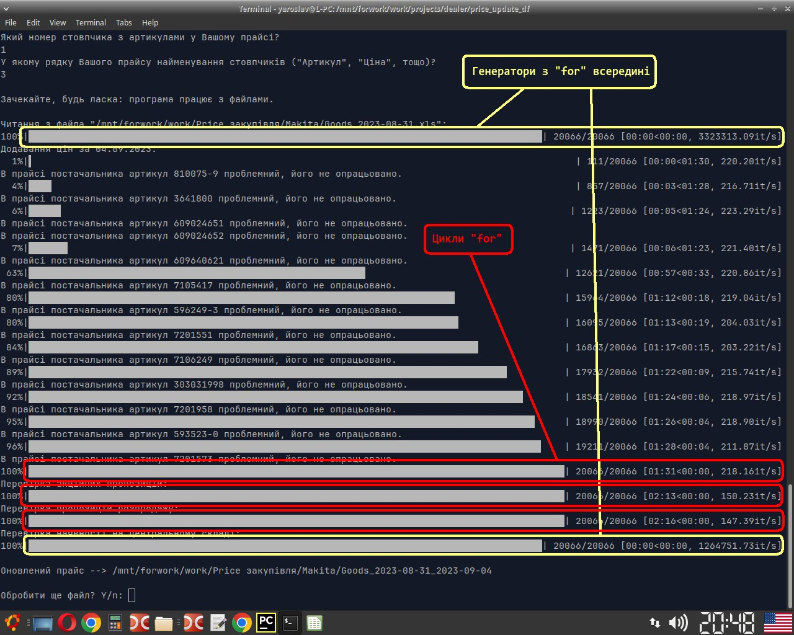
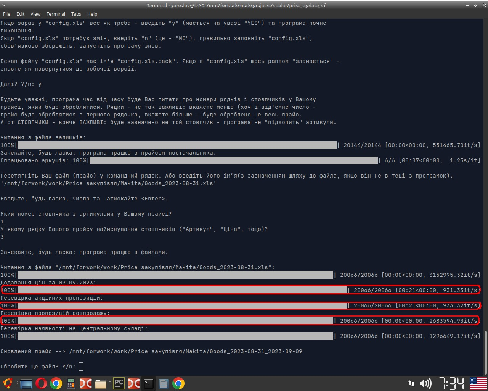
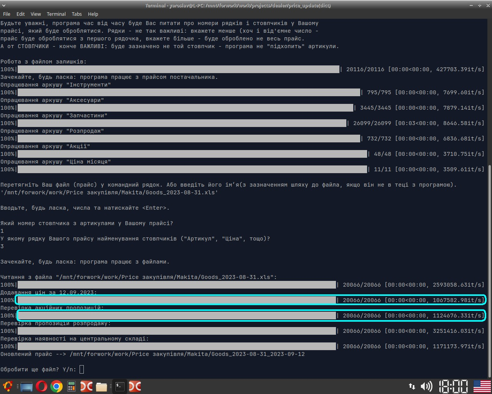

_The program receives 3+ files as input_:
1. goods in the supplier's warehouses (20k+ rows);
2. the current supplier's price list (45k+rows);
3. custom price list(s).

_The program does_:
1. indicates which product from the user price list is in the supplier's main warehouse;
2. updates prices, marks goods as "Sale", "Promo" etc., saves a copy of updated user's price list.

This version of the program uses Python dictionaries. Improves in speed (some processes are 1000 times faster) and in error handling in the supplier file compared to earlier versions.

Program with 2 generators ahd 3 loops:

Only generators:

Generators and dict():

